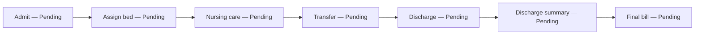
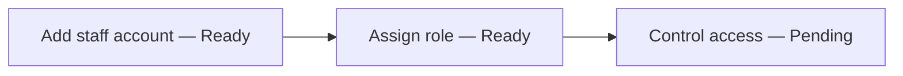

# Medistra HMS — Client Overview

## 1. About Medistra HMS

Medistra HMS brings patient, visit, admission, nursing, pharmacy and billing work into one hospital system.
It gives reception, clinical teams, pharmacy and accounts a shared view of hospital records.
Staff can register patients, book visits, record care, manage beds and collect payments.
Administrators can manage staff accounts and decide which screens each role can use.
The main benefit is less scattered record keeping; several important handoffs still need work before daily clinical use.

## 2. System at a Glance

| Scope                 | Ready | Partly Ready | Not Working | Planned |
| --------------------- | ----: | -----------: | ----------: | ------: |
| Sidebar modules (11)  |     0 |           11 |           0 |       0 |
| Sidebar sections (50) |     6 |           44 |           0 |       0 |

**Estimated overall readiness: 56%.** This is an estimate based on a review of the system: Ready sections count as 100%, Partly Ready as 50%; it is not a live-site or hospital acceptance test. Most sections have working screens and saved records, but safety, access and cross-department handoffs remain incomplete.

## 3. Module Overview

| Module           | Section             | What it does                                                   | Used by                                        | Status                                                                                                                                                       |
| ---------------- | ------------------- | -------------------------------------------------------------- | ---------------------------------------------- | ------------------------------------------------------------------------------------------------------------------------------------------------------------ |
| Dashboard        | Dashboard           | Shows role-based hospital activity and shortcuts.              | All six roles                                  | Partly Ready — figures and shortcuts exist; verify totals against real hospital operations.                                                                  |
| Patients         | Register Patient    | Records a new patient and assigns a hospital ID.               | Admin, Receptionist                            | Partly Ready — ID is generated, but duplicate matching and strong field checks need work.                                                                    |
| Patients         | All Patients        | Searches and lists patient records.                            | All six roles                                  | Partly Ready — list and export exist; broad access to sensitive details needs review.                                                                        |
| Patients         | Patient Profile     | Shows patient details and linked visits, admissions and bills. | Admin, Doctor, Nurse, Receptionist             | Partly Ready — linked history is shown, but some history lookups can fail without a clear warning.                                                           |
| Patients         | Documents           | Adds and views patient documents.                              | Admin, Doctor, Receptionist                    | Partly Ready — records can be attached; real file storage depends on setup, and file uploads do not check the user's role or access to the selected patient. |
| OPD              | Book Appointment    | Books a patient visit with a doctor.                           | Admin, Doctor, Receptionist                    | Partly Ready — booking is connected to saved appointments; slot and duplicate-booking safeguards need review.                                                |
| OPD              | Today's Queue       | Displays and updates the visit queue.                          | Admin, Doctor, Receptionist                    | Partly Ready — queue actions are present; handoff into a completed consultation is not automatic.                                                            |
| OPD              | All Appointments    | Lists, changes or cancels appointments.                        | Admin, Doctor, Receptionist                    | Partly Ready — the actions are present; schedule rules need stronger enforcement.                                                                            |
| Consultation     | Consultations       | Records and reviews consultation notes.                        | Admin, Doctor                                  | Partly Ready — records can be saved; the visit record is not a fully joined clinical encounter.                                                              |
| Consultation     | Prescriptions       | Creates and reviews medicine orders.                           | Admin, Doctor                                  | Partly Ready — orders can be saved and sent to the pharmacy list; a dependable print-ready prescription is missing.                                          |
| Consultation     | Vital Signs         | Records clinical measurements.                                 | Admin, Doctor, Nurse                           | Partly Ready — recording is connected; history and clinical safety checks need review.                                                                       |
| Consultation     | Medical History     | Adds and reviews patient history.                              | Admin, Doctor                                  | Partly Ready — records can be added; the history screen needs reliable completeness checks.                                                                  |
| IPD / Admissions | New Admission       | Opens an inpatient admission for a patient.                    | Admin, Doctor, Receptionist                    | Partly Ready — admissions save; bed eligibility and availability are not safely enforced.                                                                    |
| IPD / Admissions | Admitted Patients   | Lists current inpatients.                                      | Admin, Doctor, Nurse, Receptionist, Accountant | Partly Ready — list is available; ward and care handoffs need stronger checks.                                                                               |
| IPD / Admissions | Transfer Bed        | Moves an inpatient to another bed.                             | Admin                                          | Partly Ready — transfer records and bed statuses update, but the bed checks are not atomic or reliable under simultaneous use.                               |
| IPD / Admissions | Discharge           | Records discharge details and frees the bed.                   | Admin                                          | Partly Ready — discharge fields are saved; it does not produce and settle the final inpatient bill.                                                          |
| IPD / Admissions | Discharge Summary   | Reviews discharge information.                                 | Admin, Doctor                                  | Partly Ready — summary fields exist; a complete, printable clinical document is not provided.                                                                |
| IPD / Admissions | Admission History   | Lists past admissions.                                         | Admin, Doctor                                  | Partly Ready — history is available; completeness depends on consistent admission records.                                                                   |
| Wards & Beds     | Bed Availability    | Shows bed status and ward occupancy.                           | Admin, Doctor, Nurse, Receptionist             | Partly Ready — availability view exists; it can disagree with admissions when updates overlap.                                                               |
| Wards & Beds     | Wards               | Creates and manages wards.                                     | Admin                                          | Ready — ward records can be created, viewed, changed and removed.                                                                                            |
| Wards & Beds     | Rooms               | Creates and manages rooms.                                     | Admin                                          | Ready — room records can be created, viewed, changed and removed.                                                                                            |
| Wards & Beds     | Beds                | Creates and manages individual beds.                           | Admin                                          | Partly Ready — records can be managed; assignment does not reliably block an unavailable bed.                                                                |
| Nursing          | Admitted Patients   | Shows the inpatient roster.                                    | Admin, Nurse                                   | Partly Ready — the roster is connected; assigned-patient and ward access needs validation.                                                                   |
| Nursing          | Vital Signs         | Records bedside measurements.                                  | Admin, Nurse                                   | Partly Ready — records can be entered and exported; alerting and escalation are absent.                                                                      |
| Nursing          | Nursing Notes       | Records nursing observations and actions.                      | Admin, Nurse                                   | Partly Ready — notes can be saved; review and sign-off controls are limited.                                                                                 |
| Nursing          | Medication Rounds   | Records scheduled medication administration.                   | Admin, Nurse                                   | Partly Ready — administration records exist; they are not reliably tied to a doctor's active order.                                                          |
| Pharmacy         | Prescriptions       | Reviews prescriptions awaiting dispensing.                     | Admin, Pharmacist                              | Partly Ready — prescriptions are listed; medicine matching and partial-fill handling need work.                                                              |
| Pharmacy         | Dispense Medicines  | Records dispensing and can print a receipt.                    | Admin, Pharmacist                              | Partly Ready — dispensing saves and changes stock, but stock can be deducted without a safe all-or-nothing check.                                            |
| Pharmacy         | Medicines           | Manages the medicine catalogue.                                | Admin, Pharmacist                              | Partly Ready — catalogue actions exist; stock and expiry safeguards need strengthening.                                                                      |
| Pharmacy         | Categories          | Manages medicine categories.                                   | Admin, Pharmacist                              | Ready — category records can be created, viewed, changed and removed.                                                                                        |
| Pharmacy         | Stock               | Shows and adjusts medicine quantities.                         | Admin, Pharmacist                              | Partly Ready — quantities can be changed; negative stock, audit and transaction safeguards are incomplete.                                                   |
| Pharmacy         | Expiry              | Lists expired and soon-to-expire medicines.                    | Admin, Pharmacist                              | Partly Ready — expiry lists exist; preventing expired stock from being dispensed needs enforcement.                                                          |
| Billing          | Create Bill         | Creates an itemised patient bill.                              | Admin, Receptionist, Accountant                | Partly Ready — bills can be created; charges are not automatically collected from care and pharmacy work.                                                    |
| Billing          | Bills               | Finds and reviews bills.                                       | Admin, Receptionist, Accountant                | Partly Ready — bills can be reviewed and printed from the screen; a controlled, standard bill printout needs finishing.                                      |
| Billing          | Payments            | Records patient payments.                                      | Admin, Receptionist, Accountant                | Partly Ready — payment records are supported; reconciliation and refund controls are incomplete.                                                             |
| Billing          | Outstanding Dues    | Lists unpaid balances.                                         | Admin, Accountant                              | Partly Ready — outstanding balances are shown; follow-up and reconciliation are manual.                                                                      |
| Reports          | Summary             | Shows summary figures.                                         | Admin                                          | Partly Ready — summary is available; confirm each figure against reconciled records.                                                                         |
| Reports          | Patients            | Shows patient report data.                                     | Admin                                          | Partly Ready — patient reporting exists; exports and privacy controls need review.                                                                           |
| Reports          | Appointments        | Shows appointment activity.                                    | Admin                                          | Partly Ready — report and export are present; totals depend on consistent appointment statuses.                                                              |
| Reports          | Doctors             | Shows doctor activity.                                         | Admin                                          | Partly Ready — report screen exists; validate its figures before management use.                                                                             |
| Reports          | Admissions          | Shows inpatient activity.                                      | Admin                                          | Partly Ready — report screen exists; bed and admission data can become inconsistent.                                                                         |
| Reports          | Pharmacy            | Shows pharmacy activity.                                       | Admin, Pharmacist                              | Partly Ready — report is present; stock and dispensing totals need reconciliation.                                                                           |
| Reports          | Billing             | Shows bills and payment activity.                              | Admin, Accountant                              | Partly Ready — report and export are present; finance totals need reconciliation.                                                                            |
| Settings         | Hospital Profile    | Stores hospital details and preferences.                       | Admin                                          | Partly Ready — profile fields save; finish configuration and verify uploaded branding.                                                                       |
| Settings         | Users               | Creates, edits and disables staff accounts.                    | Admin                                          | Partly Ready — account management exists; a user-detail lookup can return staff information without the expected access check.                               |
| Settings         | Roles & Permissions | Assigns role permissions.                                      | Admin                                          | Partly Ready — role controls exist; server-side gaps mean menu hiding alone cannot protect patient information.                                              |
| Settings         | Doctors             | Manages doctor profiles.                                       | Admin                                          | Ready — doctor profiles can be created, viewed, changed and removed.                                                                                         |
| Settings         | Staff               | Manages staff profiles.                                        | Admin                                          | Ready — staff profiles can be created, viewed, changed and removed.                                                                                          |
| Settings         | Departments         | Manages hospital departments.                                  | Admin                                          | Ready — department records can be created, viewed, changed and removed.                                                                                      |
| Settings         | Doctor Schedule     | Stores doctor working hours.                                   | Admin                                          | Partly Ready — schedule records exist; booking does not consistently enforce them.                                                                           |

## 4. What Is Not Working

| Module                    | Problem (simple words)                                                                                                                                                                          | Impact on hospital                                                                        | Severity (High/Medium/Low) |
| ------------------------- | ----------------------------------------------------------------------------------------------------------------------------------------------------------------------------------------------- | ----------------------------------------------------------------------------------------- | -------------------------- |
| Patients / Documents      | One file-upload path accepts uploads without checking the user's sign-in or patient access. Without real storage setup, the system can show a success message while keeping only a sample link. | Patient documents may be exposed or appear saved when the file is not actually available. | High                       |
| Settings / Users          | Any signed-in user can request another staff member's full account record without an appropriate role or hospital check.                                                                        | Staff details may be visible to an unauthorised person.                                   | High                       |
| Sign-in                   | Older plain-text passwords are still accepted, and demo accounts use a shared published password.                                                                                               | Patient and staff information is at risk if demo access or old passwords remain enabled.  | High                       |
| Pharmacy                  | Dispensing reduces stock before the complete dispensing record is safely saved; no reliable check blocks every invalid or insufficient-stock dispense.                                          | Stock counts and pharmacy charges can be wrong.                                           | High                       |
| Wards & Beds / Admissions | Admission and transfer update the bed separately from the patient admission, without a reliable last-second availability check.                                                                 | Two patients may be assigned the same bed, or a bed board may show the wrong state.       | High                       |
| Billing / IPD             | Discharge does not automatically prepare the patient's final inpatient bill.                                                                                                                    | Charges may be missed, delayed or calculated by hand.                                     | High                       |
| Consultation / Nursing    | Medication rounds are recorded separately from a complete, verified doctor order and patient administration workflow.                                                                           | Staff may not have one dependable view of what was ordered and given.                     | High                       |
| Patient records           | Patient ID generation is random; duplicate patients are not reliably detected before registration.                                                                                              | Duplicate charts or an ID collision can split a patient's history.                        | Medium                     |
| Billing                   | A bill can be printed from the screen, but standard, complete patient-facing bills and prescription printouts are not consistently available.                                                   | Reception may need to prepare or reformat paperwork manually.                             | Medium                     |
| Operations                | No backup and restore workflow is provided in the application.                                                                                                                                  | A system or storage failure may cause prolonged downtime or lost records.                 | High                       |
| Reports                   | Reports and exports exist in several sections, but no complete, verified export and reconciliation process covers all daily operations.                                                         | Managers may make decisions from incomplete or mismatched totals.                         | Medium                     |

## 5. Important Changes Needed

| Change required                                                                                                                                   | Why it matters                                                                     | Effort | Priority              |
| ------------------------------------------------------------------------------------------------------------------------------------------------- | ---------------------------------------------------------------------------------- | ------ | --------------------- |
| Require sign-in, role permission and patient/organization checks for every upload and user-detail request.                                        | Patient and staff information must only be available to authorised people.         | Medium | 1 — Before daily use  |
| Remove plain-text password support; change shared demo passwords and disable demo accounts outside demonstrations.                                | A published or weak password can expose the whole hospital system.                 | Medium | 1 — Before daily use  |
| Make medicine dispensing one safe operation: validate the order, expiry and available quantity, then save the dispense and stock change together. | Prevents wrong stock, lost records and dispensing beyond available stock.          | Large  | 1 — Before daily use  |
| Make bed assignment and transfer check availability and update admission and bed state together.                                                  | Prevents double-booking beds and inaccurate ward boards.                           | Large  | 1 — Before daily use  |
| Require real private file storage, file type and size checks, patient access checks, and a visible upload failure if storage is unavailable.      | Patient files must be private and must not be reported as saved when they are not. | Medium | 1 — Before daily use  |
| Add input checks for patient identity, duplicate records, dates, charges, payment amounts and required clinical fields.                           | Prevents avoidable errors in patient records and accounts.                         | Medium | 1 — Before daily use  |
| Add audit history for changes to clinical records, bills, payments, stock and access rights.                                                      | Staff need to trace who changed important information and when.                    | Large  | 1 — Before daily use  |
| Set up and prove scheduled backups and a restore process.                                                                                         | The hospital needs a practical way to recover records after failure.               | Medium | 1 — Before daily use  |
| Add standard printable patient bills, payment receipts, prescriptions and discharge summaries.                                                    | Patients and hospital teams need usable, consistent paperwork.                     | Medium | 2 — Early improvement |
| Connect visit, prescription, dispensing, nursing administration and billing records, with clear handoff and reconciliation.                       | Reduces repeated entry and missed steps between departments.                       | Large  | 2 — Early improvement |

## 6. Key Workflows

In these diagrams, **Pending** means the section is Partly Ready: the screen and some saving work, but the complete hospital handoff is unfinished.

### Patient visit

### Admission

### Admin

The first two admin steps have working screens and save paths. Access control is only partly ready because direct requests do not all enforce the same checks.

## 7. Roles and Access

| Role                | What the role can access today                                                                                                                                                                      | Access control state                                                                                                          |
| ------------------- | --------------------------------------------------------------------------------------------------------------------------------------------------------------------------------------------------- | ----------------------------------------------------------------------------------------------------------------------------- |
| Super Admin / Admin | All modules, including users, roles, hospital setup and reports.                                                                                                                                    | Broad access is intended; still protect sensitive actions and audit changes.                                                  |
| Doctor              | Dashboard; patient list/profile/documents; OPD queue and appointments; consultations, prescriptions, vital signs and medical history; selected admission views and new admission; bed availability. | Menu permissions and access checks exist in many areas; a few direct requests do not check role and patient access correctly. |
| Nurse               | Dashboard; patient list/profile; nursing patients, vital signs, notes and medication rounds; ward availability/list; current admissions.                                                            | Role is limited in the menus; assigned patient and medication-order checks need strengthening.                                |
| Receptionist        | Dashboard; patient registration/list/profile/documents; booking, queue and appointment list; new/current admissions; bed availability; bill creation, bills and payments.                           | Daily reception actions are exposed; upload and access checks need fixes before real patient data.                            |
| Pharmacist          | Dashboard; patient list; pharmacy prescriptions, dispensing, medicines, categories, stock and expiry; pharmacy report; prescription view.                                                           | Role is focused on pharmacy; safe stock, expiry and order checks are incomplete.                                              |
| Accountant          | Dashboard; patient list; current admissions; all billing sections; billing report.                                                                                                                  | Role is focused on accounts; payment and report reconciliation need improvement.                                              |

**Access control note:** menus are filtered by role and most data actions are checked on the server. This is not yet dependable enough for real patient information: the file-upload path and direct user-detail request are notable gaps, and the demo credentials must not be used in production.

## 8. Suggested Additions

These are additions that are not complete hospital services today. A status of Planned means not built as a working workflow.

| Priority | Addition                                                                  | Benefit                                                               | Effort | Status  |
| -------- | ------------------------------------------------------------------------- | --------------------------------------------------------------------- | ------ | ------- |
| 1        | Laboratory orders, sample tracking and results                            | Keeps test requests and results with the patient visit.               | Large  | Planned |
| 1        | Radiology requests and reports                                            | Tracks imaging work and links reports to the patient.                 | Large  | Planned |
| 1        | Insurance / TPA claim handling                                            | Supports insurer approvals, claims and balances.                      | Large  | Planned |
| 1        | Complete printable bills, receipts, prescriptions and discharge summaries | Gives patients and staff clear, standard paperwork.                   | Medium | Planned |
| 1        | Verified backup and restore service                                       | Protects hospital records and supports recovery.                      | Medium | Planned |
| 2        | SMS / WhatsApp appointment reminders                                      | Reduces missed appointments and manual calls.                         | Medium | Planned |
| 2        | Full report export and scheduled management reports                       | Helps administrators review and share reconciled figures.             | Medium | Planned |
| 2        | Strong patient identity and duplicate matching                            | Reduces duplicate charts and keeps history together.                  | Medium | Planned |
| 3        | Patient portal for appointments, reports and bills                        | Lets patients view selected information and complete follow-up tasks. | Large  | Planned |

### Roadmap

| Phase   | Focus                                                                                                                                     | Suggested outcome                                      |
| ------- | ----------------------------------------------------------------------------------------------------------------------------------------- | ------------------------------------------------------ |
| Phase 1 | Close access and data-safety gaps; validate patient, medicine, bed and finance operations; establish backups; finish essential printouts. | Safe, controlled pilot for core daily work.            |
| Phase 2 | Connect OPD, clinical, pharmacy, inpatient nursing and billing handoffs; add laboratory, radiology, insurance and reminders.              | Fewer manual handoffs and broader hospital coverage.   |
| Phase 3 | Add patient portal, scheduled reporting and further automation after operational review.                                                  | Better patient self-service and management visibility. |

## 9. Quick Start per Role

| Role                | Five daily tasks and menu                                                                                                                                                                                                                                                                                                          |
| ------------------- | ---------------------------------------------------------------------------------------------------------------------------------------------------------------------------------------------------------------------------------------------------------------------------------------------------------------------------------- |
| Super Admin / Admin | Review activity — **Dashboard**; register/search a patient — **Patients**; review bed and admission status — **IPD / Admissions** and **Wards & Beds**; manage users and permissions — **Settings**; review collections and activity — **Billing** and **Reports**.                                                                |
| Doctor              | Review today's queue — **OPD → Today's Queue**; open patient details — **Patients → All Patients / Patient Profile**; record consultation — **Consultation → Consultations**; create medicine orders — **Consultation → Prescriptions**; record observations or review history — **Consultation → Vital Signs / Medical History**. |
| Nurse               | Review current inpatients — **Nursing → Admitted Patients**; record bedside readings — **Nursing → Vital Signs**; add care notes — **Nursing → Nursing Notes**; record a medication round — **Nursing → Medication Rounds**; check ward and bed status — **Wards & Beds → Bed Availability**.                                      |
| Receptionist        | Register or find a patient — **Patients → Register Patient / All Patients**; book a visit — **OPD → Book Appointment**; update today's queue — **OPD → Today's Queue**; start an admission — **IPD / Admissions → New Admission**; create a bill or record payment — **Billing → Create Bill / Payments**.                         |
| Pharmacist          | Review orders — **Pharmacy → Prescriptions**; dispense medicines — **Pharmacy → Dispense Medicines**; check stock — **Pharmacy → Stock**; maintain the medicine list — **Pharmacy → Medicines / Categories**; review expiry and pharmacy figures — **Pharmacy → Expiry / Reports → Pharmacy**.                                     |
| Accountant          | Review outstanding balances — **Billing → Outstanding Dues**; create or review a bill — **Billing → Create Bill / Bills**; record a payment — **Billing → Payments**; check current admissions — **IPD / Admissions → Admitted Patients**; review billing activity — **Reports → Billing**.                                        |

## 10. Summary

**Ready:** The core screens and saved-record paths for managing wards, rooms, medicine categories, doctor profiles, staff profiles and departments are in place. Patient registration assigns a hospital ID; appointments, clinical records, admissions, pharmacy transactions, bills, payments and reports have working workflows.

**Broken or incomplete:** Access checks have gaps; documents can appear saved without a real file; stock and bed changes are not reliably protected against conflicting updates; clinical and pharmacy handoffs are loose; discharge does not complete the final bill; operational backups and several standard printouts are missing.

**Top five fixes:**

1. Secure upload and staff-detail access checks; remove shared demo and plain-text password access.
2. Make medicine dispensing safe and auditable.
3. Prevent unavailable or double-booked beds during admission and transfer.
4. Validate patient, clinical, billing and payment data; add change history.
5. Configure and prove private document storage, backups and restore.

**Top five additions:**

1. Complete printable bills, receipts, prescriptions and discharge summaries.
2. Laboratory workflow and result recording.
3. Radiology workflow and reports.
4. Insurance / TPA approvals and claims.
5. SMS / WhatsApp reminders and complete report exports.

**Recommended next steps:** fix the high-priority access and data-safety gaps; configure private storage and tested backups; run a supervised pilot using dummy patient records; reconcile each workflow with hospital staff; only then use it for live patient care and financial records.

### Status counts

| Ready | Partly Ready | Not Working | Planned |
| ----: | -----------: | ----------: | ------: |
|     6 |           44 |           0 |       0 |
